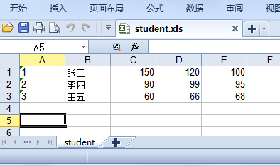

# question
纯文本文件 student.txt为学生信息, 里面的内容（包括花括号）如下所示：
```
{
	"1":["张三",150,120,100],
	"2":["李四",90,99,95],
	"3":["王五",60,66,68]
}
```
请将上述内容写到 student.xls 文件中，如下图所示：


# link
- [show-me-the-code](https://github.com/Yixiaohan/show-me-the-code)
- [xlwt](https://github.com/python-excel/xlwt/)
- [xlrd](https://github.com/python-excel/xlrd)
