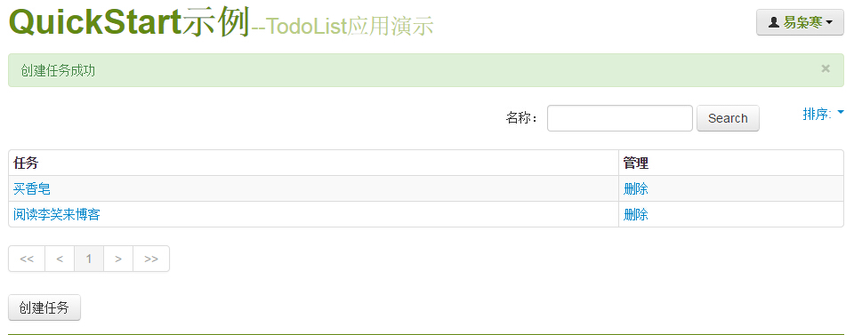

# question
使用 Python 的 Web 框架，做一个 Web 版本 TodoList 应用。


# illustion
```
redis-server &
cd todo
python app.py
```


# link
- [show-me-the-code](https://github.com/Yixiaohan/show-me-the-code)
- [runoob-bootstrap4](http://www.runoob.com/bootstrap4/bootstrap4-tutorial.html)
- [runoob-redis](http://www.runoob.com/redis/redis-tutorial.html)
- [bootstrap4](https://v4.bootcss.com/)
- [flask](http://docs.jinkan.org/docs/flask/index.html)


